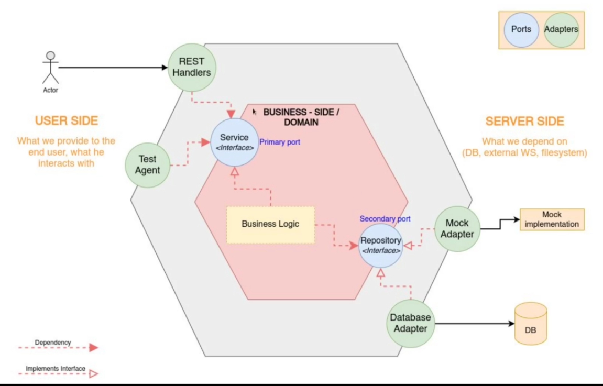

# Golang Rest API
## Hexagonal Architecture
.
### User Side
1. Request HTTP web server
### Domain
1. Folder structure
	```bash
    ├── cmd
    │   ├── api
    │   │   └── main.go
    │   └── web
    ├── domain
    │   └── users
    │       ├── handler.go
    │       ├── model.go
    │       └── service.go
    ├── errs
    ├── foo.db
    ├── go.mod
    ├── go.sum
    ├── README.md
    ├── router
    │   └── router.go
    └── storage
        ├── memcached
        │   └── user.go
        ├── memory
        │   └── user.go
        ├── mysql
        ├── postgres
        ├── redis
        │   └── user.go
        └── sqlite
            └── user.go
    ```
2. Explain
	1. `cmd/api/main` is used for web api
	2. `domain`
	   - `users` is an object is an object which doing business logic on it
	   	 - `handler.go`
	   	 - `model.go`
	   	 - `service.go`
	3. `errs` is used to defined an errors
	4. `router` is defined all route request from User Side
	5. `storage` is defined backend for Server Side
	   - `memory/user.go` is stored in memory
	   - `memcached/user.go` is stored in Memcached Server
	   - `redis/user.go` is stored in Redis Server
	   - `mysql/user.go` is stored in MySQL Server
	   - `sqlite/user.go` is stored in SQLITE
	6.
#### Models Object
1. Usually a business logic of web app(tables in database, ..)
2. Define Model - `domain/users/model.go`
   ```go
   // User domain table
   type User struct {
	   ID       string `json:"id"`
       Email    string `json:"email"`
	   Password string `json:"-"`
	   Role     string `json:"role"`
	   Status   string `json:"status"`
   }
   ```
##### Object Interface
###### Models Object Interface
1. `domain/users/model.go`
   ```go
   // Repository defined all methods for storage implementation
   type Repository interface {
	   FindAll() ([]User, error)
	   ByEmail(email string) (*User, error)
   }
   ```
###### Service Object Interface
1. `domain/users/service.go` file
   ```go
   // UserServiceRepo defined all methods for service implementation
   type UserServiceRepo interface {
	   GetUsers() ([]User, error)
	   GetUserByEmail(email string) (*Response, error)
   }
   ```
#### Service Object
1. Implemeting the [Service Object Interface](#service-object-interface) - `domain/users/service.go`
   ```go
   // UserService object which implementing all methods in UserServiceRepo
   type UserService struct {
	   uRepo Repository
   }

   // GetUsers ...
   func (u UserService) GetUsers() ([]User, error) {
	   return u.uRepo.FindAll()
   }

   // GetUserByEmail ...
   // Using Data Transfer Object - Response Object
   func (u UserService) GetUserByEmail(email string) (*Response, error) {
	   	result, err := u.uRepo.ByEmail(email)
		if err != nil {
			return nil, err
		}

		// temp := Response{}.DTO(*result)
		temp := result.DTOResponse()
		return temp, nil
   }

   // NewService return a UserServiceRepo interface
   func NewService(uRepo Repository) UserServiceRepo {
	   return &UserService{
		   uRepo: uRepo,
	   }
   }
   ```
2. Implemeting the Data Transfer Object
	1. User Request Data - `domain/users/model.go`
	   ```go
       // Request is using for Data Transform Object - DTO.
	   // As converting data for create user request data
	   // https://github.com/gin-gonic/gin#bind-form-data-request-with-custom-struct
       type Request struct {
           Email    string `form:"email" json:"email"`
           Password string `form:"password" json:"password"`
           Role     string `form:"role" json:"role"`
           Status   string `form:"status" json:"status"`
       }
       ```
	2. Response Data Object to User Side - `domain/users/model.go`
	   ```go
       // Response is using for Data Transform Object - DTO.
       // As a response to User Side request
       type Response struct {
       	ID     string `json:"id"`
       	Email  string `json:"email"`
       	Role   string `json:"role"`
       	Status string `json:"status"`
       }

       // statusToText converting number to string
       func (u User) statusToText() string {
       	if u.Status == "1" {
       		return "Active"
       	}
       	return "In-Active"
	   }

	   // DTOResponse is using for Data Transform Object.
       func (u User) DTOResponse() *Response {
       	return &Response{
       		ID:     u.ID,
       		Email:  u.Email,
       		Role:   u.Role,
       		Status: u.statusToText(),
       	}
	   }
       ```
#### Handler Object
1. Link together the [Service Object](#service-object) to [Service Side](#server-side)
   ```go
   // UserHandler ...
   type UserHandler struct {
	   us UserServiceRepo
   }

   // GetUsers ...
   func (u UserHandler) GetUsers(c *gin.Context) {
	   allusers, err := u.us.GetUsers()
	   if err != nil {
		   c.JSON(http.StatusInternalServerError, gin.H{
			   "err": err.Error(),
		   })
	   }

	   c.JSON(http.StatusOK, gin.H{
		   "data": allusers,
	   })
   }

   // GetUserByEmail ...
   func (u UserHandler) GetUserByEmail(c *gin.Context) {
	   email := c.Param("email")
	   user, err := u.us.GetUserByEmail(email)
	   if err != nil {
		   c.JSON(http.StatusInternalServerError, gin.H{
			   "err": err.Error(),
		   })
		   return
	   }

	   c.JSON(http.StatusOK, gin.H{
		   "data": user,
	   })
   }

   // NewHandler return a UserServiceRepo
   func NewHandler(uRepo UserServiceRepo) *UserHandler {
	   return &UserHandler{
		   us: uRepo,
	   }
   }
   ```
### Server Side
1. Implementing the [Models Object Interface](#models-object-interface)
   1. `storage/memory/user.go`
	   ```go
	   package memory

	   import (
		   "errors"

		   "github.com/alochym01/thecodecamp_1/domain/users"
	   )

	   var temp = []users.User{
		   {ID: "1000", Email: "hadn4@fpt.com.vn", Password: "Alochym@123", Role: "Husband", Status: "1"},
		   {ID: "1002", Email: "nhuntt@fpt.com.vn", Password: "Alochym@123", Role: "Wife", Status: 	"1"},
	   }

	   // Repository is storage on memory and Repository is implemented all method of users.UserRepo
	   type Repository struct {
		   users []users.User
	   }

	   // NewRepository return a users.Repository interface
	   func NewRepository() users.Repository {
		   return &Repository{
			   users: temp,
		   }
	   }

	   // FindAll ...
	   func (u Repository) FindAll() ([]users.User, error) {
		return u.users, nil
	   }

	   // ByEmail ...
	   func (u Repository) ByEmail(email string) (*users.User, error) {
		   // user, err := u.db.QueryRow("select * from users where email=?", email)
		   for i := range temp {
			   if temp[i].Email == email {
				   return &temp[i], nil
			   }
		   }
		   return nil, errors.New("Email Not Found")
	   }
	   ```
   2. `storage/sqlite/user.go`
		```go
		package sqlite

		import (
		   	"database/sql"
		   	"fmt"

		   	"github.com/alochym01/thecodecamp_1/domain/users"
		)

		// Repository is storage on sqlite and Repository is implemented all method of users.UserRepo
		type Repository struct {
		   	db *sql.DB
		}

		// NewRepository return a domain.UserRepo
		func NewRepository(db *sql.DB) users.Repository {
		   	return &Repository{
		   		db: db,
		   	}
	    }

		// FindAll ...
		func (u Repository) FindAll() ([]users.User, error) {
		   	sqlstmt := "select * from users"

		   	rows, err := u.db.Query(sqlstmt)

		   	// check err from server DB and Query DB
		   	if err != nil {
		   		fmt.Println("Server Err", err.Error())
		   		// return nil, errs.NewServerError(err.Error())
		   	}

		   	temp := []users.User{}
		   	// users := make([]users.User, 0)

		   	for rows.Next() {
		   		c := users.User{}
		   		err := rows.Scan(&c.ID, &c.Email, &c.Password, &c.Role, &c.Status)
		   		// check err from server DB and Scan function
		   		if err != nil {
		   			if err == sql.ErrNoRows {
		   				fmt.Println("Not Found", err.Error())
		   				// return nil, errs.NewNotFoundError(sql.ErrNoRows.Error())
		   				return nil, err
		   			}
		   			fmt.Println("Server Err", err.Error())
		   			// return nil, errs.NewServerError("Server Error")
		   			return nil, err
		   		}
		   		temp = append(temp, c)
		   	}
		   	return temp, nil
		}

		// ByEmail ...
		func (u Repository) ByEmail(email string) (*users.User, error) {
		   	sqlstmt := "select * from users where email=?"
		   	row := u.db.QueryRow(sqlstmt, email)
		   	c := users.User{}
		   	err := row.Scan(&c.ID, &c.Email, &c.Password, &c.Role, &c.Status)
		   	if err != nil {
		   		if err == sql.ErrNoRows {
		   			fmt.Println("Not Found", err.Error())
		   			return nil, err
		   			// return nil, errs.NewNotFoundError(sql.ErrNoRows.Error())
		   		}
		   		fmt.Println("Server Err", err.Error())
		   		return nil, err
		   		// return nil, errs.NewServerError(err.Error())
		   	}

		   	return &c, nil
		}
		```
4.
## Reference
1. Data in Form - <https://github.com/monoculum/formam>
2. <https://github.com/gin-gonic/gin#bind-form-data-request-with-custom-struct>