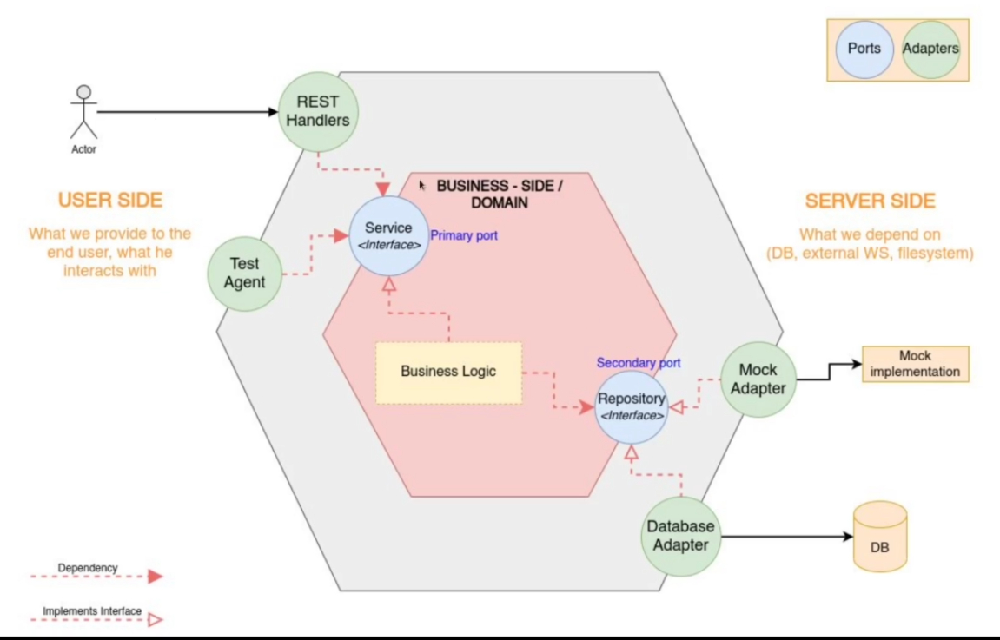

# Hexagonal Architechture
.
## Folders Structure
## Domain Object
1. Create User Table
   ```go
   // User tables
   type User struct {
   	ID       string
   	Email    string
   	Password string
   	Role     string
   	Status   string
   }
   ```
### Domain Business Logic
1. Define User Repository Interface
   ```go
   // UserRepo ...
   type UserRepo interface {
	   FindAll() ([]User, *errs.AppErrs)
   	ByID(string) (*User, *errs.AppErrs) // *User => return nil
   }
   ```
2. Define User Service Interface
   ```go
   // UserServiceRepo ...
   type UserServiceRepo interface {
	   GetAllUser() ([]domain.User, *errs.AppErrs)
	   GetUserByID(string) (*domain.User, *errs.AppErrs)
   }
   ```
## User Side
1. Make a http request to server
## Connect the User side to Server side via handlers
1. Create UserHandler
   ```go
   // UserHandler ...
   type UserHandler struct {
	   Service service.UserServiceRepo
   }
   ```
## Server Side
1. Create UserDB struct
   ```go
   // UserDB ...
   type UserDB struct {
	   db *sql.DB
   }
   ```
2. Implement User Repository methods
   1. Database Adapter
      ```go
      func (u UserDB) FindAll() ([]User, *errs.AppErrs) {}
      func (u UserDB) ByID(id string) (*User, *errs.AppErrs) {}
      ```
   2. Memory Adapter
3. Define helper function to create NewUserDB
   ```go
   // NewUserDB ...
   func NewUserDB(dbConn *sql.DB) UserRepo {
	   return UserDB{
		   db: dbConn,
	   }
   }
   ```
## Service Adapter
1. Define UserService struct
   ```go
   // UserService ...
   type UserService struct {
   	repo domain.UserRepo
   }
   ```
2. Implement Service Repository methods
   ```go
   // GetAllUser ...
   func (cs UserService) GetAllUser() ([]domain.User, *errs.AppErrs) {
   	return cs.repo.FindAll()
   }

   // GetUserByID ...
   func (cs UserService) GetUserByID(id string) (*domain.User, *errs.AppErrs) {
   	return cs.repo.ByID(id)
   }
   ```
3. Define helper function to create NewUserService
   ```go
   // NewUserService ...
   func NewUserService(User domain.UserRepositoryDB) UserServiceRepo {
   	return UserService{
   		repo: User,
	   }
   }
   ```